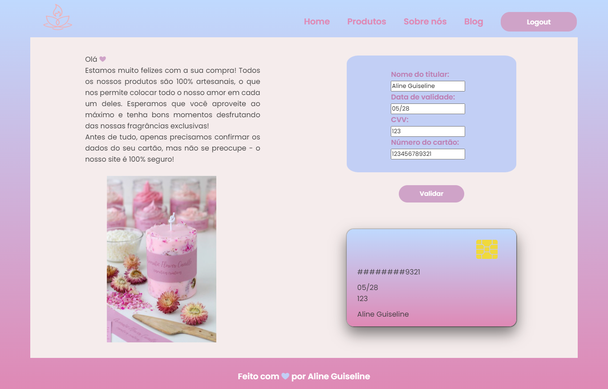
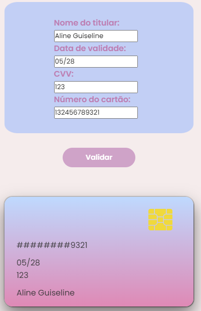
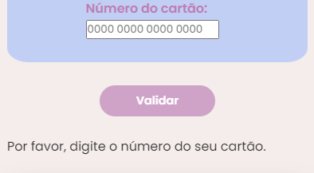
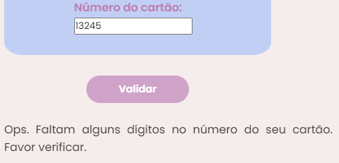
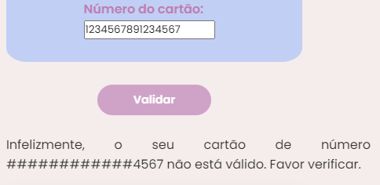
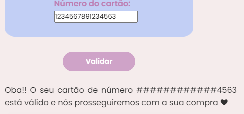

# Validação de cartão de crédito - Candle Store 🪔

Projeto criado junto ao bootcamp da Laboratória, com o objetivo de verificar cartões de crédito, simulando a área de compra de uma loja de velas. 

🔗 [Clique aqui para acessar](https://alineguiseline.github.io/card-validation-candle-store/)

## Índice

* [1. Introdução](#1-Introdução)
* [2. Interface](#2-interface)
* [3. Objetivos alcançados](#3-objetivos-alcançados)
* [4. Ferramentas utilizadas](#4-ferramentas-utilizadas)
* [5. Contato](#5-contato)

## 1. Introdução

Com o aumento exponencial e inegavelmente crescente das compras online, é comum deparar-nos com uma tela de compras, que nos permite inserir os dados do nosso cartão e conferir se ele encontra-se disponível para compras ou não. Aliado a isso, a busca por métodos alternativos de relaxamento e terapia também estão em alta, sobretudo após o estressante período provocado pela pandemia de COVID-19 - dentre tantas técnicas e ferramentas, as velas aromatizadas e personalizadas sempre são uma boa pedida!

Dado este contexto, foi criada a área de validação de cartão de uma loja fictícia para venda de velas artesanais. A fim de conferir privacidade e funcionalidade, foram utilizadas técnicas para mascarar os primeiros dígitos, deixando somente os 4 últimos visíveis (independente da quantidade de caracteres) e para validar o cartão, indicando se ele está disponível para compra ou não, através do [algoritmo de Luhn](https://en.wikipedia.org/wiki/Luhn_algorithm).

O algoritmo de Luhn, também chamado de módulo 10, é um método de soma de verificação, usado para validar números de identificação, como o IMEI de telefones celulares, cartões de crédito etc.

Esse algoritmo é simples. Obtemos o inverso do número a ser verificado (que contém apenas dígitos [0-9]); todos os números que ocupam uma posição par devem ser multiplicados por dois; se esse número for maior ou igual a 10, devemos adicionar os dígitos do resultado; o número a verificar será válido se a soma de seus dígitos finais for um múltiplo de 10.

## 2. Interface

A proposta do projeto era apresentar uma interface intuitiva e visualmente estimulante, com tons delicados e formas/fontes arredondadas, a fim de transparecer uma sensação de conforto e acolhimento.

Para proporcionar maior dinâmica à plataforma, ao inserir os dados do cartão, é possível vê-los aparecendo, também, na réplica de cartão abaixo - um detalhe sutil, porém agradável aos olhos.

Foram pensadas 4 situações possíveis para este contexto, bem como 4 respostas distintas da plataforma:

1. O usuário não digitar os números do cartão

2. O usuário digitar poucos números (abaixo de 13)

3. O cartão do usuário estar inválido

4. O cartão do usuário estar válido

## 3. Objetivos alcançados

✨ Criação de uma plataforma que permita ao usuário inserir o número do seu cartão de crédito e validá-lo

✨ Ocultação de todos os dígitos do cartão, com exceção dos 4 últimos

✨ Conhecer e trabalhar com as ferramentas de manutenção e melhoria no código (linters e testes unitários)

✨ Planejar e construir uma interface pensada no usuário, pautada, principalmente, na sua experiência

✨ Implementação de controle de versão com Git e Github

## 4. Ferramentas utlizadas
🛠️ HTML

🛠️ CSS

🛠️ JavaScript

🛠️ Git/Github

## 5. Contato

💙 https://www.linkedin.com/in/alineguiseline/
